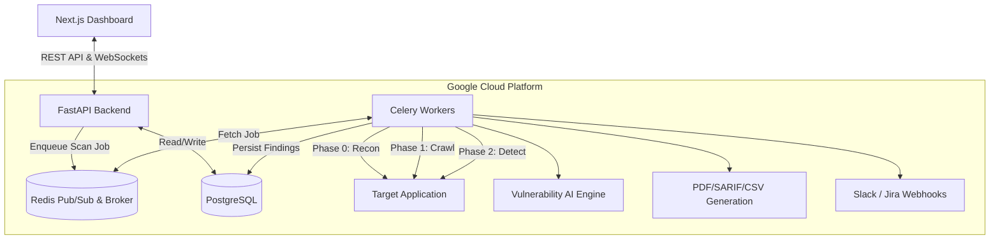

<div align="center">

# 🛡️ AI Vulnerability Scanner V2 (Enterprise Edition)

### Cloud-Native, Asynchronous Web Application Security Assessment Framework

[](https://fastapi.tiangolo.com/)
[](https://nextjs.org/)
[](https://postgresql.org)
[](https://www.docker.com/)
[](LICENSE)
[](SECURITY.md)

<p align="center">
  <strong>Enterprise-grade AI vulnerability scanner. Featuring multi-tenant data isolation, asynchronous Celery workers, ML-based CVSS scoring, CDN bypass detection, and a high-performance Next.js interface.</strong>
</p>

---

**⚠️ Authorized Use Only** — Only scan targets you own or have explicit written permission to test.

</div>

---

## 🎯 Overview

AI Vulnerability Scanner V2 is a professional-grade, cloud-native web application security testing framework. Re-architected from the ground up for massive scalability, it abandons synchronous execution in favor of a distributed task queue system, providing real-time WebSocket updates to a sleek, modern frontend.

### What Sets This Apart

| Feature | Traditional Scanners | **AI Vuln Scanner V2 (Enterprise)** |
|---------|---------------------|----------------------|
| **Architecture** | Monolithic / Synchronous | **Distributed Microservices** (FastAPI, Celery, Redis) |
| **Vulnerability Classification** | Rule-based severity | **ML-powered CVSS scoring** with NVD-trained models |
| **CDN Detection** | ❌ None | **Automatic CDN/WAF fingerprinting** with origin IP discovery |
| **Multi-Tenancy** | Single-user local DB | **Enterprise RBAC isolation** (Org Admin, Analyst, Viewer) |
| **Analyst Workflow** | Read-only reports | **Triage, assign, and Jira issue creation** native to the UI |
| **IP Intelligence** | ❌ None | **Full recon: ASN, PTR, CDN bypass, internal IP leakage** |

---

## 🏗️ Architecture



---

## 🔍 Scanning Modules

### 🔎 IP Intelligence (Phase 0)
Pre-scan reconnaissance that runs before any crawling begins.
- **IP Resolver**: DNS A/AAAA resolution, reverse DNS (PTR), ASN/RDAP lookup (org, country)
- **CDN Detector**: Fingerprints CDN providers via response headers (Cloudflare, Fastly, Akamai, etc.)
- **CDN Bypass**: Origin IP discovery via crt.sh SSL certificate history and DNS history records.
- **IP Leakage**: Detects private IPs (RFC1918, loopback) leaking in headers, HTML, JS files, and JSON API responses.

### ⚡ Vulnerability Detectors (Phases 3-7)
- **Cross-Site Scripting (XSS)**: Reflected & Stored (two-pass detect).
- **SQL Injection (SQLi)**: Error-based and Boolean-based differential analysis.
- **Server-Side Request Forgery (SSRF)**: Actively prevents loopback/internal IP targeting with strict `ipaddress` parsing.
- **IDOR**: Auth vs. Unauth differential fuzzing.
- **Path Traversal & Open Redirects**: Advanced payload injection mapping.

### 🤖 AI Classification (Phase 8)
- **GradientBoosting classifier** trained on NVD-derived reference data.
- Outputs exact **CVSS 3.1 score**, severity rating, and CWE ID classification with high confidence.

---

## 🚀 Quick Start (Local Deployment)

### Prerequisites
- [Docker](https://docs.docker.com/get-docker/) & [Docker Compose](https://docs.docker.com/compose/install/)

### Installation

```bash
# 1. Clone the repository
git clone https://github.com/Tktirth/AI-VULN.-SCANNER-V2.git
cd AI-VULN.-SCANNER-V2

# 2. Start the entire microservice stack (Postgres, Redis, FastAPI, Celery, Next.js)
docker-compose up -d --build

# 3. Access the Dashboard
open http://localhost:3000

# 4. Access Interactive API Docs
open http://localhost:8000/docs
```
*(Note: Database migrations run automatically on API startup via Alembic).*

---

## 🎯 Safe Demo Targets
To safely test the AI Vulnerability Scanner's capabilities, we recommend scanning these intentionally vulnerable (and legally safe) demo applications. **Do not scan other targets without explicit written authorization.**

### 1. Acunetix VulnWeb (Highly Recommended)
Lightning-fast PHP/ASP environments specifically built to trigger XSS, SQLi, and Path Traversal. Perfect for verifying your scanner's core logic:
- **PHP Version:** `http://testphp.vulnweb.com/`
- **ASP Version:** `http://testasp.vulnweb.com/`

### 2. Altoro Mutual (IBM)
A simulated banking application containing major vulnerabilities including Stored XSS and broken access controls.
- **URL:** `http://demo.testfire.net/`
- *(Tip: Test the Form Authentication module by passing `admin` / `admin` into the scanner's auth config!)*

### 3. OWASP Broken Crystals
A modern React-based application designed to evaluate modern web vulnerabilities (excellent for testing crawler interaction with modern DOMs and headers).
- **URL:** `https://brokencrystals.com/`

### 4. Zero Bank (Micro Focus)
A simulated banking app with a large surface area for crawling, IDOR fuzzing, and SQLi testing.
- **URL:** `http://zero.webappsecurity.com/`

---

## ☁️ Enterprise Cloud Deployment

This repository ships with full Infrastructure-as-Code (IaC) to deploy to Google Cloud Platform via **Terraform**.

```bash
cd terraform
terraform init
terraform plan -var="project_id=YOUR_PROJECT_ID"
terraform apply -var="project_id=YOUR_PROJECT_ID"
```

### CI/CD Automation
The `.github/workflows/cloudbuild.yaml` triggers automatically on `main` branch pushes. It securely builds, tests, and deploys the containerized services to **Google Cloud Run**, linking them to **Cloud SQL** and **Memorystore Redis**.

---

## 🛡️ Ethical Use & Legal Notice

This tool is intended for **authorized security testing and educational purposes only**.

- ✅ Scan your own applications
- ✅ Scan with explicit written authorization
- ❌ **Never scan without permission**
- ❌ **Never use for malicious purposes**

The authors assume **no liability** for misuse.

---

## 🤝 Contributing
See [CONTRIBUTING.md](CONTRIBUTING.md) for architecture deep-dives and development workflows.

## 📄 License
This project is licensed under the MIT License — see the [LICENSE](LICENSE) file for details.
